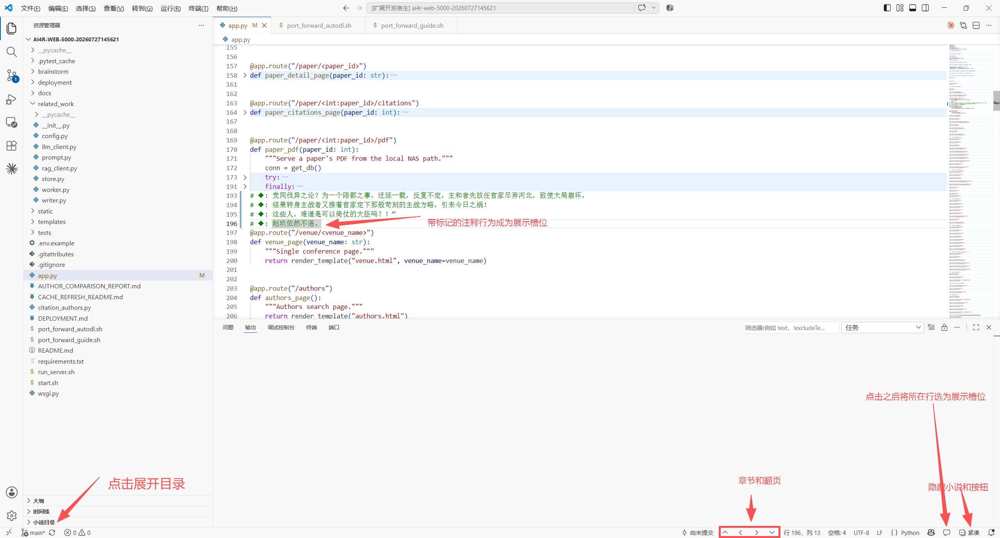
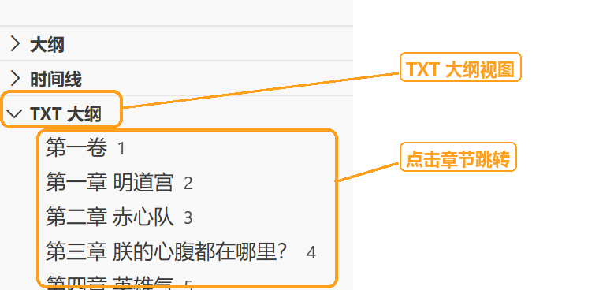
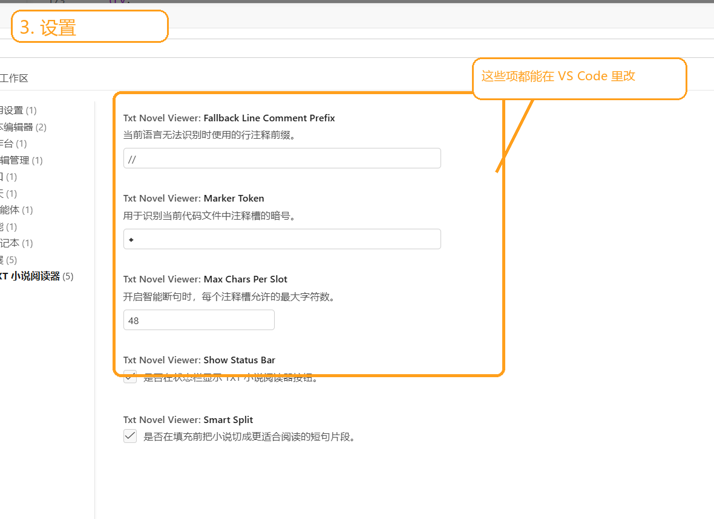

# TXT 小说注释阅读器

把 `.txt` 小说分页填入当前代码文件里的暗号注释槽中。

## 功能

- 自动识别当前文件语言的注释语法，识别不到时回退到 `//`
- 只替换包含暗号的注释行
- 过滤 txt 空行，支持智能断句
- 自动识别章节目录，目录项可点击跳转
- 支持上一章、上一页、下一页、下一章
- 支持紧凑模式，收起目录和常规状态栏按钮
- 支持状态栏按钮、命令面板和快捷键
- 阅读进度按“小说文件 + 当前代码文件”保存

## 快速开始

1. 在代码文件里选中几行，执行 `TXT 小说阅读器：初始化插槽`
2. 执行 `TXT 小说阅读器：打开 TXT 小说`
3. 用状态栏按钮、快捷键或目录继续阅读

## 状态栏

状态栏保留以下入口：

- `上一章`
- `上一页`
- `下一页`
- `下一章`
- `插槽`
- `紧凑模式`

## 快捷键

默认快捷键使用数字入口：

- 打开 txt：`Ctrl+K 1`
- 重新打开上次小说：`Ctrl+K 2`
- 上一页：`Ctrl+K 3`
- 下一页：`Ctrl+K 4`
- 显示目录：`Ctrl+K 5`
- 刷新目录：`Ctrl+K 6`
- 设置暗号：`Ctrl+K 7`
- 初始化插槽：`Ctrl+K 8`
- 上一章：`Ctrl+K 9`
- 紧凑模式：`Ctrl+K 0`

macOS 对应为 `Cmd+K 1` 到 `Cmd+K 9`，以及 `Cmd+K 0`。

## 设置

- `txtNovelViewer.markerToken`：暗号，默认 `◆`
- `txtNovelViewer.fallbackLineCommentPrefix`：识别不到语言时使用的注释符，默认 `//`
- `txtNovelViewer.showStatusBar`：是否显示状态栏按钮，默认 `true`
- `txtNovelViewer.smartSplit`：是否启用智能断句，默认 `true`
- `txtNovelViewer.maxCharsPerSlot`：每个展示槽最大字符数，默认 `48`

## 目录

打开 txt 小说后，Explorer 侧边栏会出现 `小说目录`。

当前会识别这些章节标题：

- `第一章`、`第1章`
- `第一回`、`第1卷`、`第1节`
- `序章`、`序言`、`楔子`、`引子`、`开篇`
- `尾声`、`后记`、`番外`
- `Chapter 1`、`Part 1`

## 断句

启用智能断句时，插件会：

1. 先过滤 txt 空行
2. 在同一行内先按 `。！？!?…` 等句末标点找候选断点
3. 连续短句会尽量拼到同一个展示槽，拼上下一句超过上限才换槽
4. 单句太长时按 `，,；;、` 继续切
5. 仍然过长时按最大字符数硬切

## 截图

### 插槽填充

### 目录列表

### 设置项

## 开发

1. 用 VS Code 打开本项目，按 `F5` 启动扩展调试
2. 运行 `npm test`
3. 运行 `npm run lint`

## 发布

1. 准备 `README.md`、`CHANGELOG.md` 和图标
2. 如需开源许可，再补 `LICENSE`
3. 使用 `vsce package` 打包
4. 使用 `vsce publish` 发布到 Marketplace
